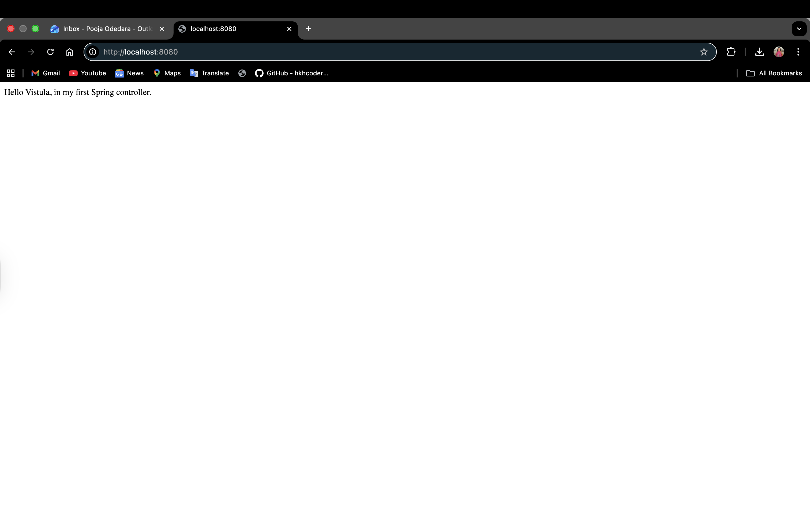
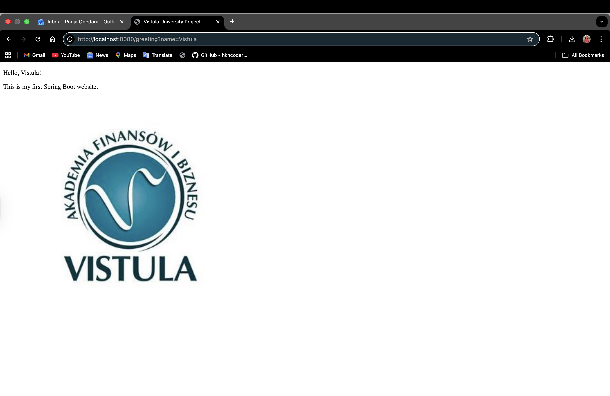

# Project 1: Spring Boot MVC Greeting Application

What is this project about?

This is a small web application I built to learn how Spring Boot handles web requests. 

The app shows a simple message when you go to the main page, and a personalized greeting with a logo when you visit the /greeting page .

How I built it:

I used these main tools to make everything work:

1)Java 26 : The programming language.

2)Maven: To build the project and manage the libraries.

3)Spring Web: This is the "engine" that lets the app talk to a browser.

4)Thymeleaf: A tool that lets me put Java data into a normal HTML webpage.

5)Lombok: To keep the code clean and short.

Use Cases (HTTP Methods)

Method: GET

Path: /

Result: Shows a simple text message.

Path: /greeting
Result: Shows an HTML page with a name and a logo

This project uses GET requests to fetch data.

1)I used the @RestController annotation to send back simple text.

2)I used the @Controller annotation to send back the greeting.html file.